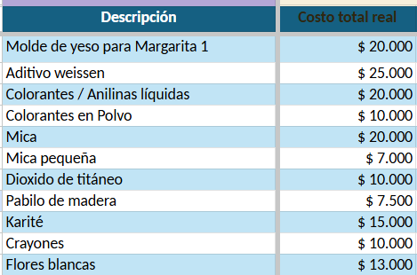
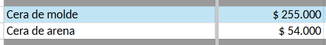
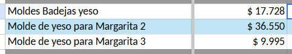
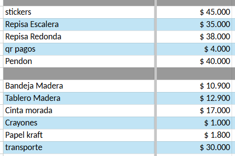
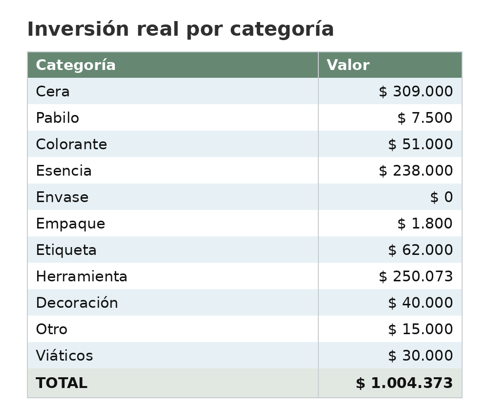
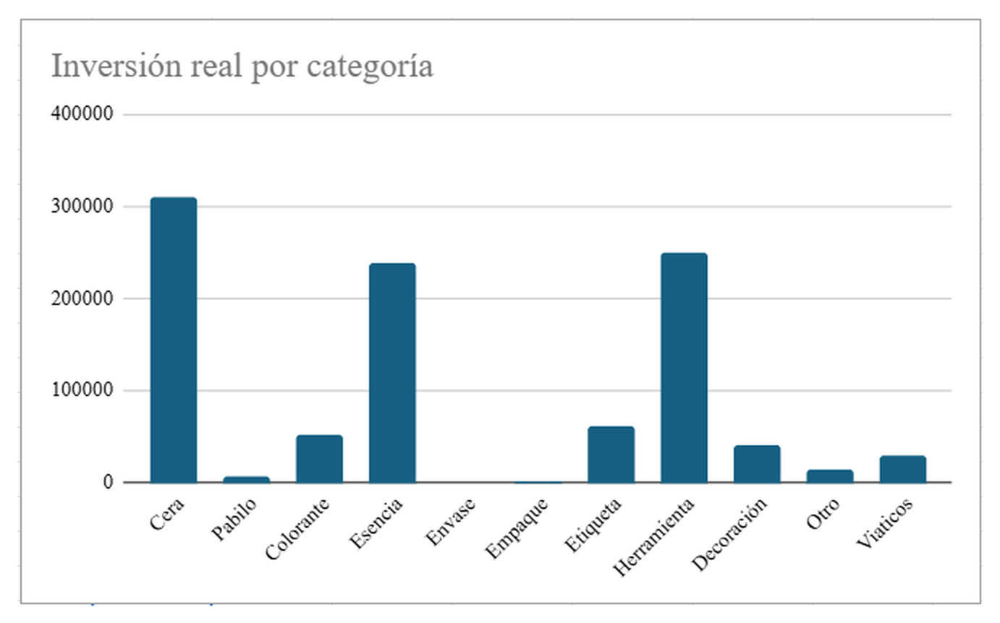
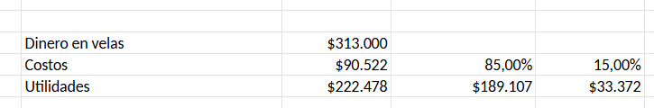
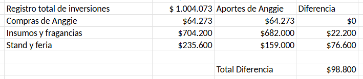

# ARCANA — Inventario, inversiones, costos y ventas

Este repositorio centraliza los documentos contables y operativos de **ARCANA** después de la reubicación en Bogotá.

## Resumen rápido de cuentas

**A solicitud de Jhon Freddy**

* **Ventas totales:** $313.000
* **Costos asociados:** $90.522
* **Utilidad total:** $222.478
* **Participación Bogotá — 85 %:** $189.107
* **Participación Villavicencio — 15 %:** $33.372
* **Dinero pendiente por reponer:** $99.100

> **Estado actual:** los datos de ventas corresponden al corte del **12 de julio de 2026**.

## Ruta rápida

| Necesito consultar | Archivo | Hoja principal |
|---|---|---|
| Existencias físicas | [Inventario ARCANA.xlsx](./Inventario%20ARCANA.xlsx) | `CERAS`, `INSUMOS`, `PAPELERÍA`, `MOLDES` y demás categorías |
| Dinero invertido y costo real de cada compra | [Registro de inversiones.xlsx](./Registro%20de%20inversiones.xlsx) | `Registro Insumos` |
| Resumen de la inversión | [Registro de inversiones.xlsx](./Registro%20de%20inversiones.xlsx) | `Dashboard` |
| Costo real y precio de cada vela | [Precio de velas y Ventas.xlsx](./Precio%20de%20velas%20y%20Ventas.xlsx) | `Velas` |
| Costo unitario de materiales | [Precio de velas y Ventas.xlsx](./Precio%20de%20velas%20y%20Ventas.xlsx) | `Materiales`, `Ceras`, `Pabilos`, `Esencias` y `Colores` |
| Cantidades vendidas | [Precio de velas y Ventas.xlsx](./Precio%20de%20velas%20y%20Ventas.xlsx) | `Ventas` |
| Informe de ingresos, costos y utilidades | [Precio de velas y Ventas.xlsx](./Precio%20de%20velas%20y%20Ventas.xlsx) | `Balance` |
| Comprobantes de las compras | [`recibos/`](./recibos/) | Recibos, facturas y transferencias |

---

## 1. Inventario ARCANA

### Para qué sirve

El archivo **Inventario ARCANA.xlsx** registra las existencias físicas del negocio: ceras, materiales orgánicos, herramientas de manipulación, insumos, papelería, moldes y velas terminadas.

### Cómo encontrar la información

1. Abre [Inventario ARCANA.xlsx](./Inventario%20ARCANA.xlsx).
2. En la parte inferior selecciona la hoja correspondiente:
   - `CERAS`: cantidades y pesos de ceras.
   - `ORGANICO`: flores y elementos naturales.
   - `MANIPULACION`: herramientas y utensilios.
   - `INSUMOS`: pigmentos, adhesivos, decoraciones y consumibles.
   - `PAPELERÍA`: cajas, cartulinas, etiquetas y elementos de presentación.
   - `MOLDES`: moldes disponibles.
   - `VELAS`: espacio destinado al inventario de producto terminado.

> **Pendiente:** actualizar las cantidades después de la feria. Hasta hacerlo, este archivo funciona como base histórica, pero no debe tomarse como stock definitivo para nuevas compras.

---

## 2. Registro de inversiones

### Cómo encontrar la información

1. Abre [Registro de inversiones.xlsx](./Registro%20de%20inversiones.xlsx).
2. Ve a `Registro Insumos` para revisar cada compra, proveedor, cantidad y costo total real.
3. Ve a `Dashboard` para consultar el consolidado por categoría y la gráfica.
4. Los soportes deberán quedar en la carpeta [`recibos/`](./recibos/).

Cada artículo registrado esta respaldado por un recibo, factura o comprobante de pago.

### Primeras inversiones

#### Insumos, colorantes y aditivos de Vela Bella

El detalle de la primera compra suma **$157.500**.

#### Ceras

La primera inversión en ceras fue de **$309.000**:

- Cera de molde: $255.000.
- Cera de arena: $54.000.

#### Fragancias

La inversión en fragancias fue de **$238.000**.

Actualmente se está gestionando la devolución de la fragancia de chocolate o, preferiblemente, su cambio por otra fragancia dulce. Hasta que el proveedor confirme el resultado, el gasto continúa registrado en el total.

- Diferencia pendiente de reposición: **$22.500**.

#### Moldes comprados por Anggie

Anggie compró **$64.273** en moldes.

#### Stand, impresiones y feria

Incluye impresiones, mobiliario, elementos del stand y gastos operativos del día de la feria.

- Presupuesto disponible: **$159.000**.
- Gasto real: **$235.600**.
- Diferencia pendiente de reposición: **$76.600**.

### Consolidado por categoría

| Categoría | Valor |
|---|---:|
| Cera | $309.000 |
| Pabilo | $7.500 |
| Colorante | $51.000 |
| Esencia | $238.000 |
| Envase | $0 |
| Empaque | $1.800 |
| Etiqueta | $62.000 |
| Herramienta | $250.073 |
| Decoración | $40.000 |
| Otro | $15.000 |
| Viáticos | $30.000 |
| **TOTAL REAL REGISTRADO** | **$1.004.373** |

### Presupuesto frente a ejecución real

| Grupo | Dinero aportado o presupuestado | Gasto real | Diferencia |
|---|---:|---:|---:|
| Insumos, ceras y fragancias | $682.000 | $704.500 | $22.500 |
| Stand y feria | $159.000 | $235.600 | $76.600 |
| Moldes de Anggie | $64.273 | $64.273 | $0 |
| **TOTAL** | **$905.273** | **$1.004.373** | **$99.100** |

La **diferencia** no es una utilidad. Es dinero que ya fue gastado y que debe reponerse para que los aportes y los gastos reales queden conciliados.

> **Control pendiente:** la hoja `Balance` actualmente muestra $1.004.073 de inversión, $704.200 en insumos y fragancias, y $98.800 de diferencia. El detalle y el `Dashboard` suman $300 más. Antes del cierre contable deben corregirse esos tres valores.

---

## 3. Costo de las velas, ventas y balance

El flujo de la información es:

`Materiales y materias primas` → `Velas` → `Precios` → `Ventas` → `Balance`

### A. Materiales y materias primas

Para llegar al costo detallado:

1. Abre [Precio de velas y Ventas.xlsx](./Precio%20de%20velas%20y%20Ventas.xlsx).
2. Consulta:
   - `Ceras`: costo por gramo de cada cera.
   - `Pabilos`: costo por centímetro o unidad.
   - `Esencias`: costo por gramo o mililitro.
   - `Colores`: costo unitario del colorante.
   - `Materiales`: envases, papelería, empaques, bisutería y demás elementos.

Estas hojas alimentan el cálculo de cada vela.

### B. Hoja `Velas`: costo real y precio

Cada fila representa un producto. Las columnas más importantes están al final:

| Columna | Qué significa |
|---|---|
| `Costo total` | Suma de cera, energía, pabilo, esencia, color, decoración, papelería e insumos. |
| `Margen` | Multiplicador aplicado al costo. Actualmente se usa **3** para calcular el precio ideal. |
| `Precio sin mano de obra` | Costo total × margen. |
| `TOTAL` | Precio calculado después de incluir mano de obra. |
| `Precio final` | Precio real de venta definido para el producto. |
| `Utilidad Ideal` | Ganancia obtenida con el precio calculado por el margen. |
| `Utilidad` | Precio final menos costo real. |
| `relacion %` | Utilidad real ÷ utilidad ideal. |

Interpretación de `relacion %`:

- **Mayor de 100 %:** la utilidad real supera la utilidad ideal.
- **Igual a 100 %:** ambas utilidades coinciden.
- **Menor de 100 %:** el precio real deja menos utilidad que la esperada.

> La hoja `Materiales` contiene los costos unitarios. La utilidad ideal y la comparación con la utilidad real se calculan en la hoja `Velas`.

### C. Hoja `Precios`: fotografía del momento de la venta

La hoja `Precios` guarda el precio y la utilidad usados para el periodo que se está contabilizando. Sirve para que una modificación posterior en costos o precios no cambie la interpretación histórica de una venta.

Antes de cambiar el precio de una vela, debe cerrarse o guardarse el periodo correspondiente.

### D. Hoja `Ventas`: cantidades vendidas

En `Ventas`:

- Cada fila corresponde a una vela.
- Las columnas de fecha registran cuántas unidades se vendieron en ese corte.
- La columna visible con fecha **12/07/2026** contiene las ventas de la feria.
- Las primeras columnas muestran costo, precio sugerido, precio actual y utilidad de referencia.

### E. Hoja `Balance`: informe contable

`Balance` cruza precios, utilidades y cantidades vendidas para obtener:

- Dinero total recibido.
- Costos de las velas vendidas.
- Utilidad total.
- Participación de cada persona.
- Diferencias entre aportes y dinero realmente ejecutado.

Para consultar un cierre:

1. Revisa que las cantidades estén completas en `Ventas`.
2. Confirma los precios y utilidades del periodo en `Precios`.
3. Abre `Balance`.
4. Lee el bloque derecho para el resumen general.
5. Revisa el bloque de inversiones para identificar dinero pendiente de reposición.

### Corte actual de ventas

| Concepto | Valor |
|---|---:|
| Dinero en velas | $313.000 |
| Costos | $90.522 |
| Utilidad total | $222.478 |
| Participación del 85 % | $189.107 |
| Participación del 15 % | $33.372 |

La distribución está configurada en **85 % / 15 %**, 

